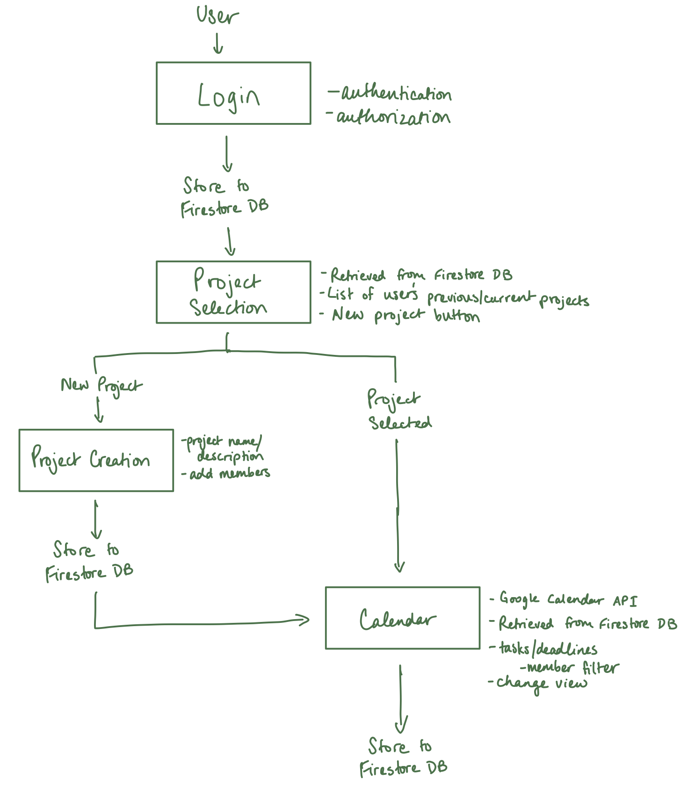

# Git + Calendar Collab

```
Description Coming Soon
```

## Usage
```
Coming Soon
```

## Project Architecture Diagram



## Github Stuff


[](https://GitHub.com/os-ucsd/leetles/issues/)

[](https://GitHub.com/os-ucsd/leetles/pull/)


## Contributors
```
Coming Soon
```

## License
[](https://opensource.org/licenses/MIT)
